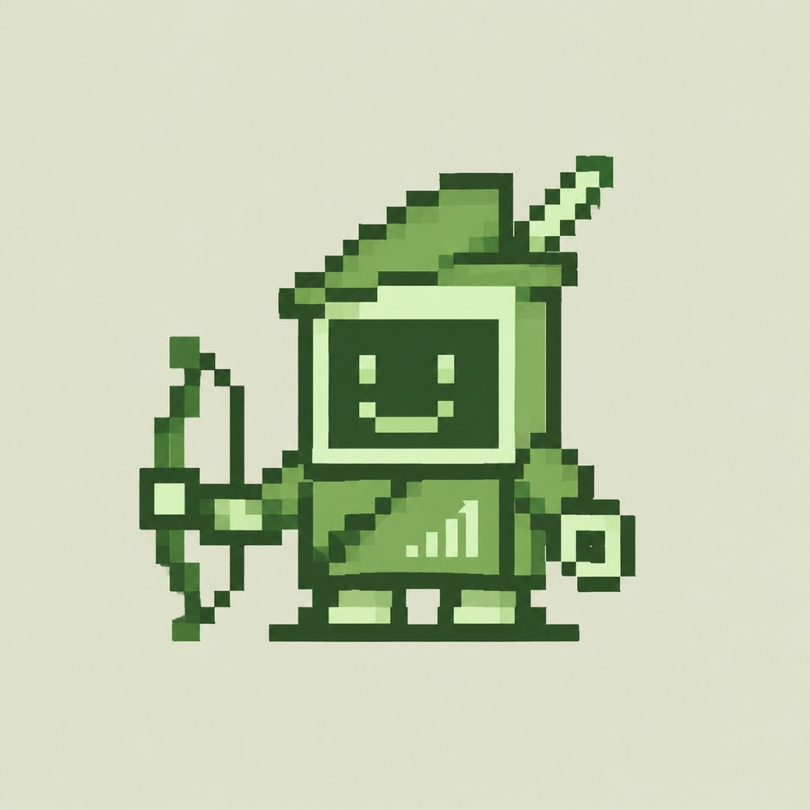
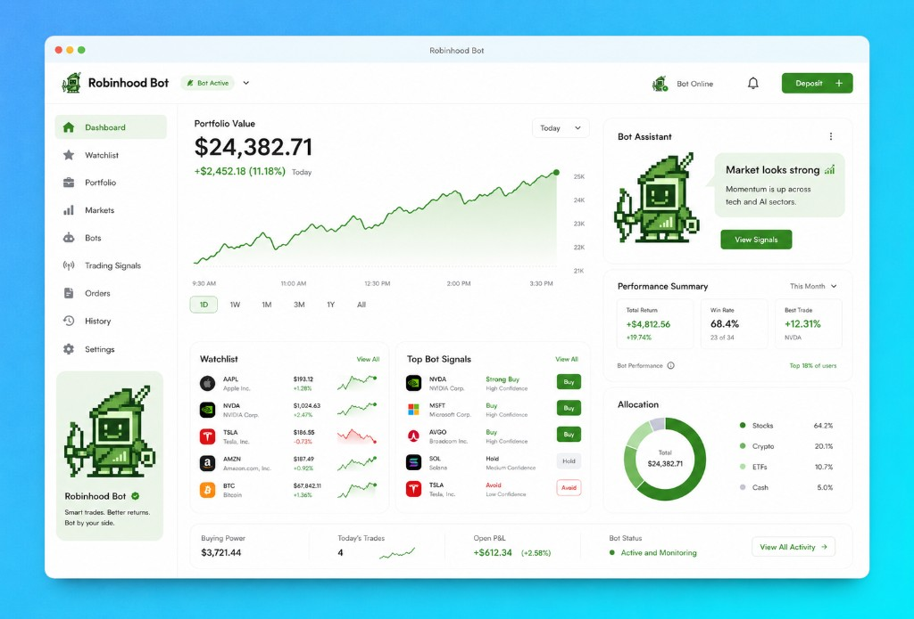

<div align="center">



# Robinhood Computer Bot

**Meet ROBBY** — your pixel-sized trading companion for the Robinhood Computer.


</div>

---

## What is this?

**Robinhood Computer Bot** is a self-hosted trading assistant that watches the market for you, scores opportunities, and turns them into clear, actionable signals inside a single dashboard. The bot behind it all is **ROBBY**.

ROBBY is not a black box that silently moves your money. He is a research analyst that never sleeps: he pulls quotes and fundamentals, tracks your watchlist, evaluates momentum across sectors, and tells you *what* he thinks and *how confident* he is. You stay the one who pulls the trigger — unless you explicitly hand him the keys.

> **Smart trades. Better returns. Bot by your side.**

### Why ROBBY

- **Always watching.** Continuous monitoring of your watchlist, portfolio, and the broader market — pre-market through after-hours.
- **Opinionated, not vague.** Every signal comes with a direction (Strong Buy / Buy / Hold / Avoid) and a confidence level, so you know how much weight to give it.
- **Explains himself.** Each call is backed by the momentum, volume, and trend data that produced it. No unexplained trades.
- **Yours alone.** Runs entirely on your machine. Your keys, your data, your rules.
- **Paper first.** Ships in paper-trading mode so you can watch ROBBY work for weeks before a single real dollar is at stake.

---

## The Dashboard

Everything ROBBY knows lives in one place: portfolio value and intraday performance, your watchlist, his top signals, allocation breakdown, and a running performance summary of how his calls have actually played out.

<div align="center">



</div>

At a glance you get:

| Panel | What it tells you |
|---|---|
| Portfolio Value | Live value with intraday, weekly, monthly, and all-time views |
| Bot Assistant | ROBBY's current read on the market, in plain language |
| Watchlist | Your tracked tickers with price, change, and sparkline trend |
| Top Bot Signals | Ranked calls with direction and confidence |
| Performance Summary | Total return, win rate, and best trade for the period |
| Allocation | Stocks, crypto, ETFs, and cash split |
| Bot Status | Whether ROBBY is active, monitoring, or paused |

---

## Features

1. **Signal engine** — momentum, trend, and volume analysis distilled into a single ranked list.
2. **Watchlist tracking** — follow stocks, ETFs, and crypto side by side.
3. **Portfolio analytics** — allocation, open P&L, buying power, and daily trade count.
4. **Paper and live modes** — validate a strategy with simulated capital, then promote it when you trust it.
5. **Strategy configuration** — position sizing, stop-loss and take-profit rules, and per-asset limits.
6. **Alerts** — get notified when a high-confidence signal fires or a risk rule trips.
7. **Full trade history** — every order and signal is logged and auditable.
8. **Web dashboard** — a clean WebUI for everything above, no terminal required.
9. **HTTP API** — drive ROBBY from your own scripts or tooling.
10. **Cross-platform** — Windows, macOS, and Linux, on x86 and ARM64.

---

## Quick Start

### Requirements

- Python 3.10 or newer
- [uv](https://docs.astral.sh/uv/) for dependency management
- Node.js with [pnpm](https://pnpm.io/) (only if you want to run the dashboard in dev mode)

### Run the bot

```bash
uv sync
uv run main.py
```

The API server starts on `http://localhost:6185` by default.

### Run the dashboard

```bash
cd dashboard
pnpm install   # first time only
pnpm dev
```

The WebUI is available at `http://localhost:3000`.

Open it, connect your brokerage credentials in **Settings**, add a few tickers to your **Watchlist**, and leave ROBBY in paper mode while you get a feel for his calls.

---

## How ROBBY Thinks

1. **Collect** — pull quotes, volume, and fundamentals for everything on your watchlist and in your portfolio.
2. **Score** — evaluate each asset against the active strategy: trend direction, momentum strength, relative volume, and sector behavior.
3. **Rank** — sort candidates and attach a confidence level to each one.
4. **Surface** — publish the result as a signal on the dashboard, with the reasoning attached.
5. **Act** — in paper mode, simulate the trade and track the outcome. In live mode, submit the order within your configured risk limits.
6. **Learn from the record** — every call is scored after the fact, so win rate and best/worst trades reflect real performance, not backtest optimism.

---

## Configuration

Strategy, risk, and connection settings are managed from the dashboard under **Settings**. The essentials:

| Setting | Purpose |
|---|---|
| Trading mode | Paper or live |
| Max position size | Cap on capital committed to any single asset |
| Stop loss / take profit | Automatic exit thresholds |
| Signal threshold | Minimum confidence before a signal becomes an order |
| Watchlist | Which assets ROBBY monitors |
| Alerts | Where and when you get notified |

---

## Development

This project uses [`ruff`](https://docs.astral.sh/ruff/) for formatting and linting, enforced by pre-commit hooks.

```bash
pip install pre-commit
pre-commit install
```

Before committing:

```bash
ruff format .
ruff check .
```

If you change backend API routes or schemas, regenerate the frontend client:

```bash
cd dashboard && pnpm generate:api
```

Commit messages follow [Conventional Commits](https://www.conventionalcommits.org/), for example `feat: add sector rotation signal` or `fix: correct allocation rounding`.

---

## Risk Disclaimer

> [!WARNING]
> Robinhood Computer Bot is software for research and automation, not financial advice. ROBBY's signals are generated from historical and real-time market data and can be wrong. Trading involves substantial risk of loss, and past performance does not predict future results. Start in paper mode, never commit money you cannot afford to lose, and review every risk setting before enabling live trading. You are solely responsible for the trades placed through this software.

---

## Contributing

Issues and pull requests are welcome. For new features, open an issue to discuss the idea first so we can agree on scope before code gets written. Please keep comments and logs in English, and run the formatter and linter before opening a PR.

---

<div align="center">


_ROBBY is standing by._

</div>
